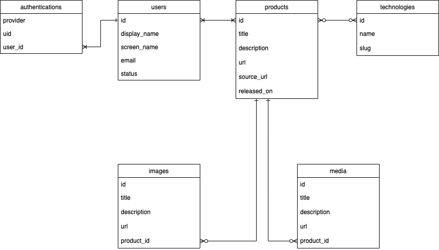

## ER図



## 環境構築手順
- 事前に管理者からmaster.keyを取得してconfig配下に置いてください。
配置しないとrails db:create で `NoMethodError: undefined method '[]' for nil:NilClass` になります。

- config/database.yml の作成
```
$ cp config/database.yml.default config/database.yml
```

### ローカル環境構築
```
$ rbenv local 3.0.0
$ bundle install --path vendor/bundle
$ yarn install
$ rails db:create
$ rails db:migrate
```
### サーバー起動
```
rails server
```

### テスト実行
```
bundle exec rspec spec
```
