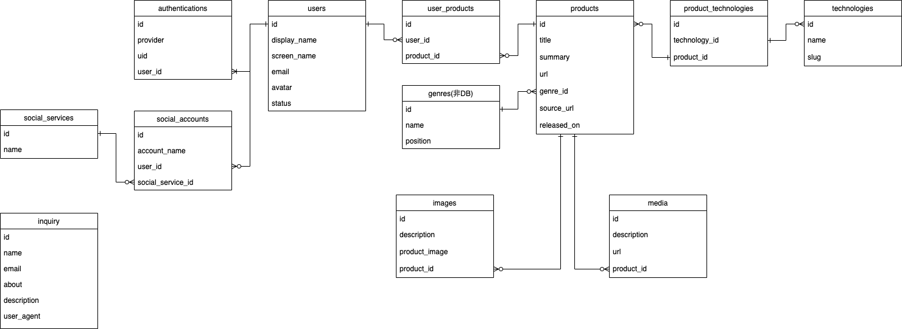

# RUNTEQ senses

## is 何？

RUNTEQ生のポートフォリオ、どこで見れるんじゃ？<br>
→ないなら作ろう

そんな感じで始まりました。みんなでカスタマイズしていけたらいいなと思っています。

## 参加したい！

まずは[Mattermostのチャンネル](https://chat.runteq.jp/runteq/channels/c01rtlnl5qx)に入ってください。

思いついた機能を[Issue](https://github.com/runteq/runteq_senses/issues)に投げるだけでも大丈夫です。<br>
実装できそうかも？と思った人は、環境構築からお願いします（ものによっては環境構築不要なものもありますが）

### 環境構築

困ったときは[先人の知恵](https://github.com/runteq/runteq_senses/issues/12)が役立つかもしれません。コマンドや記録などを残してくれると後進のためになります。

- 事前に管理者からmaster.keyを取得してconfig配下に置いてください
配置しないとrails db:create で `NoMethodError: undefined method '[]' for nil:NilClass` になります

- config/database.yml の作成

```
$ cp config/database.yml.default config/database.yml
```

```
$ rbenv local 3.0.0
$ nodenv local 14.16.1
$ bundle install --path vendor/bundle
$ yarn install
$ rails db:create
$ rails db:migrate
$ rake db:seed_fu
```

#### サーバー起動
```
rails server
```

#### テスト実行
```
bundle exec rspec spec
```

### タスクの進め方

- Issueの追加
  - やりたいことがIssueにない場合は、自分で作ってください
  - [New Issue](https://github.com/runteq/runteq_senses/issues/new)からタスクを追加する

- Issueに取り掛かる
  - `Assignees`に自分を追加して「やります表明」をする


- 実装する
  - 仕様の確認含む質問はできるだけGitHubで一元管理したいので、基本的にはGitHubで行う（Mattermostのチャンネルも都度使い分ける）

- PRを出す
  - [セルフレビュー](https://beta-chelsea.hatenadiary.jp/entry/2020/12/19/125756)をしましょう

- Approveを受けたらマージする
  - コンフリクトの解消も経験です

#### その他

- 解答などが必要な場合はメンションをすると確実です

- 1つのIssueの規模が大きい場合、PRを複数に分けて出すことをおすすめします
  - PRの粒度が小さいと、レビュワーの負担が軽くなります

- あなたのレビューも歓迎です！
  - LGTMを出すほどの自信がなくても、他人のコードを読んでコメントしてみましょう！

## 仕様

- ユーザーの導線
  - GitHubアカウントでログイン
  - 新規プロダクト（PF）を作成
  - プロダクトに紐づく関連メディア、画像を作成

### ER図


詳細は https://github.com/runteq/runteq_senses/pull/1 だけど、若干内容が変わっている。
