# Fledge Hub 機能紹介

個人開発者のための、技術を検索できる開発サービス投稿サイトです。 
GitHub アカウントでログインし、自分がつくったサービス（ポートフォリオ）を、使用技術・関連メディアとともに公開・共有できます。

> スクリーンショットはローカル環境（`docker compose up` ＋ デモ用シードデータ）で撮影したものです。サービス名・説明文・作者名・画像はすべてダミーです。

## サービス一覧・検索

| トップページ | 絞り込み検索 |
| :--- | :--- |
| 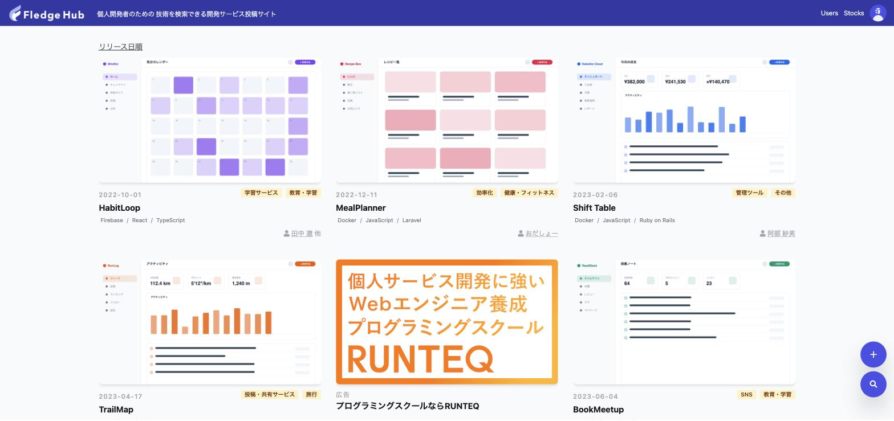 | 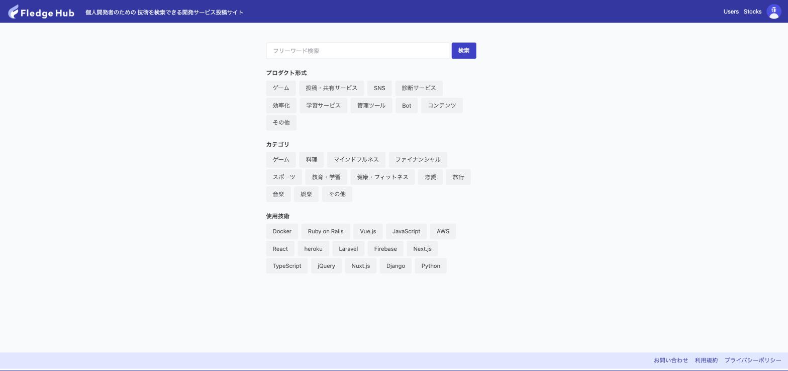 |
| リリース日順に並ぶサービスのカード一覧。各カードにサムネイル・リリース日・種別／カテゴリ・使用技術・作者が表示され、バッジから同条件のサービスへ絞り込めます。右下のフローティングボタンから検索・新規登録へ。 | フリーワードに加えて、サービス種別・カテゴリ・使用技術のチェックボックスで横断的に絞り込めます。 |

## サービスの詳細・投稿

| サービス詳細 | サービス登録・編集 |
| :--- | :--- |
| 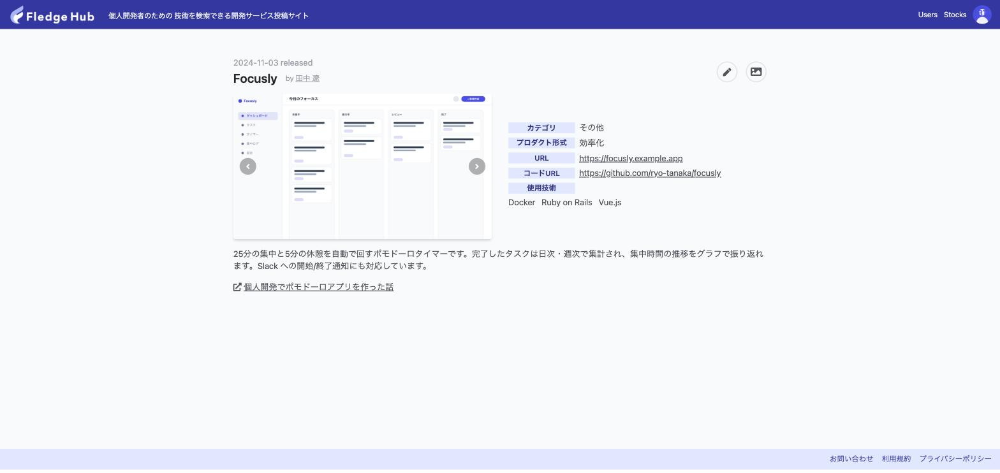 | 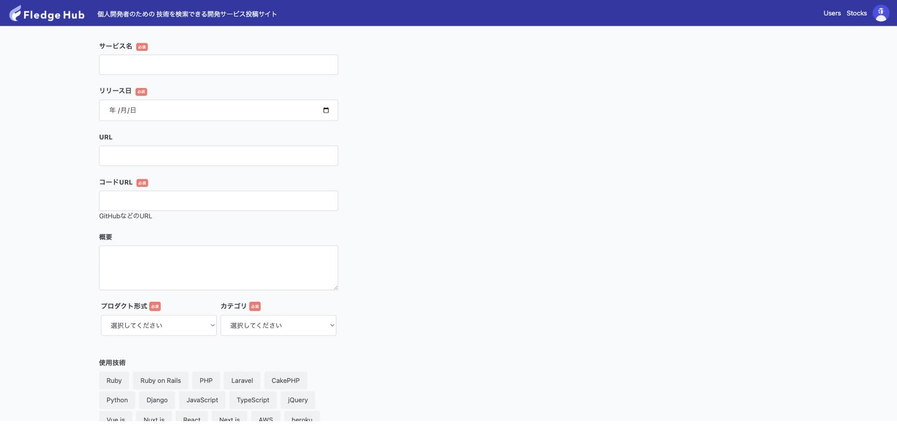 |
| スクリーンショットのカルーセル、カテゴリ・種別・URL・ソースコードURL・使用技術・概要・関連メディアを表示します。投稿者には編集ボタン、それ以外のログインユーザーにはストック（あとで見る）ボタンが出ます。 | サービス名・リリース日・URL・ソースURL・概要・種別・カテゴリ・使用技術を入力。関連記事や公式アカウントなどの「メディア」はフォームを動的に追加できます。 |

| スクリーンショットの登録 | |
| :--- | :--- |
| 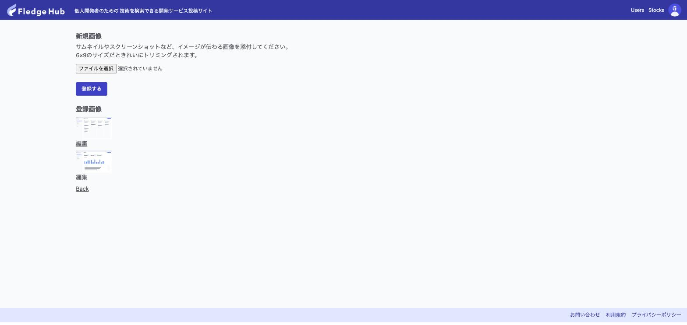 | |
| 投稿者は複数のスクリーンショットをアップロードでき、詳細ページでカルーセル表示されます。 | |

## ユーザー

| ユーザー一覧 | ユーザーページ |
| :--- | :--- |
| 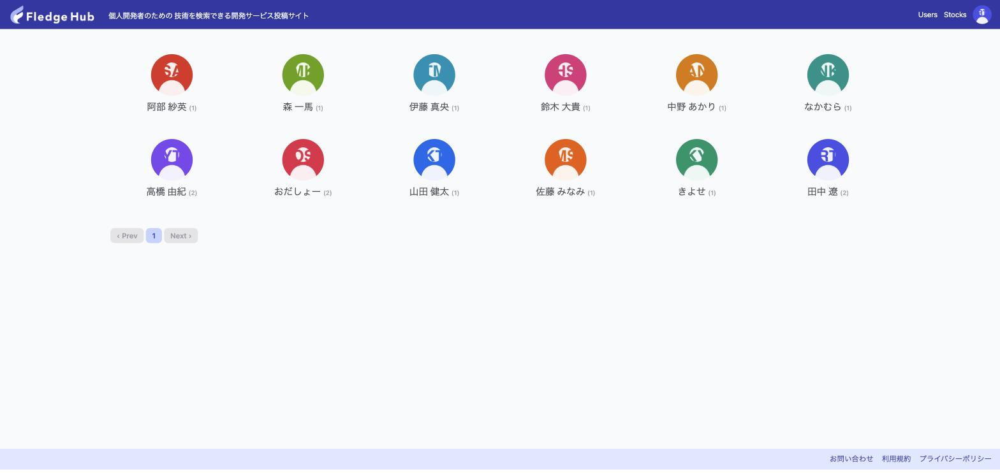 | 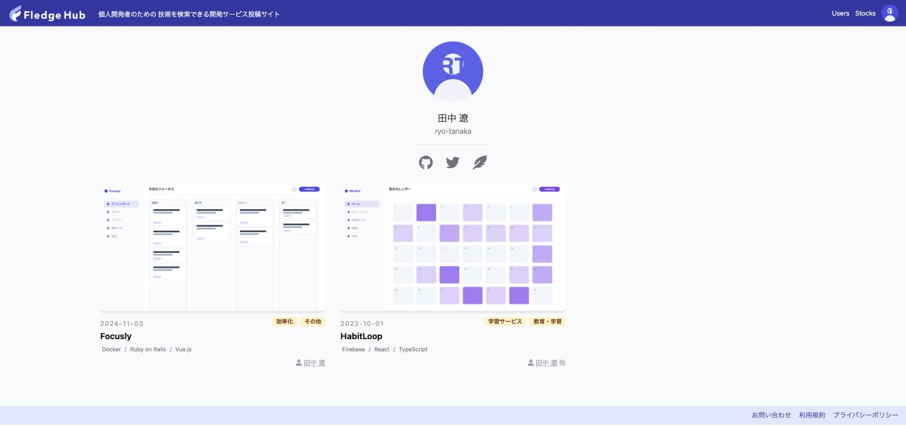 |
| 登録ユーザーをアイコンと投稿サービス数で一覧表示します。 | アイコン・表示名・各種SNSリンクと、そのユーザーが投稿したサービスの一覧。 |

## マイページ・設定

| ストック一覧 | プロフィール設定 |
| :--- | :--- |
| 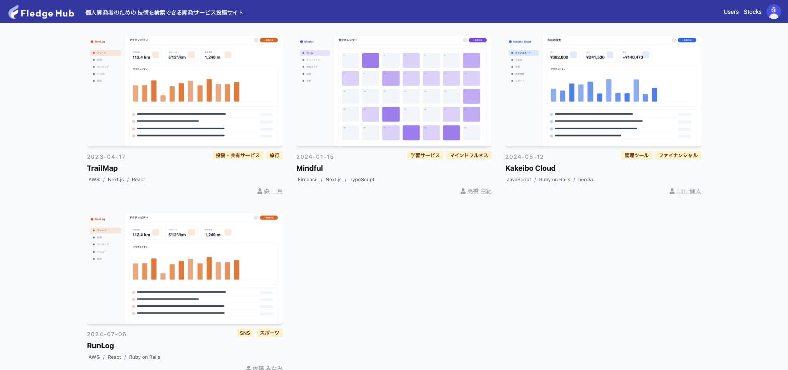 | 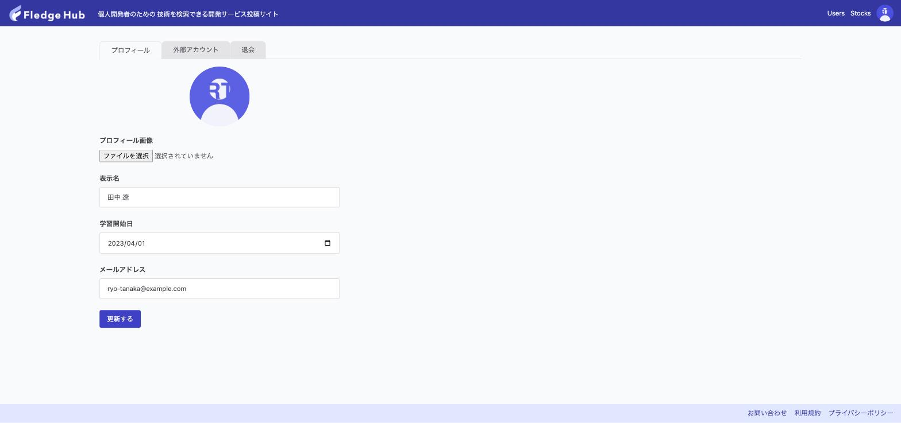 |
| ストックしたサービスをカード一覧で確認できます。 | アバター画像・表示名・学習開始日・メールアドレスを編集します。 |

| 外部アカウント設定 | 退会 |
| :--- | :--- |
| 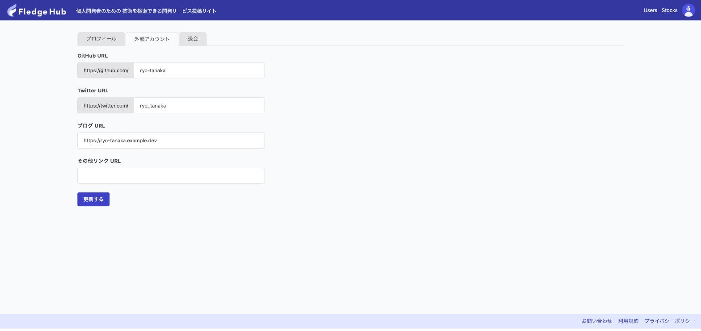 | 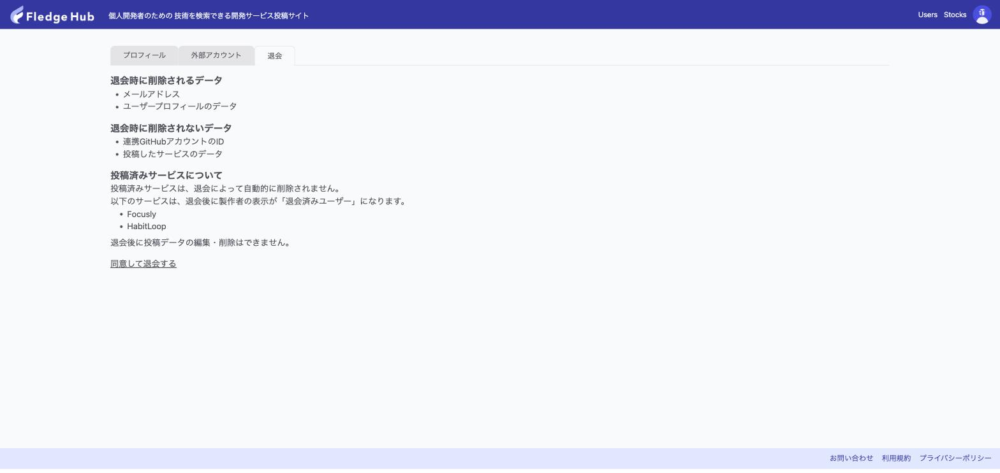 |
| GitHub・X（Twitter）・ブログなどのアカウントURL／IDを登録すると、ユーザーページにSNSリンクが表示されます。 | 退会時に削除されるデータ／されないデータを明示。投稿済みサービスは残り、製作者表示が「退会済みユーザー」になります。 |

## ログイン・その他

| GitHub ログイン | お問い合わせ |
| :--- | :--- |
| 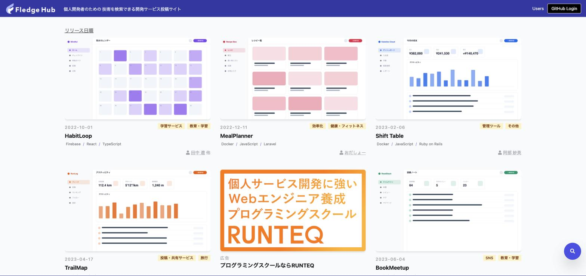 | 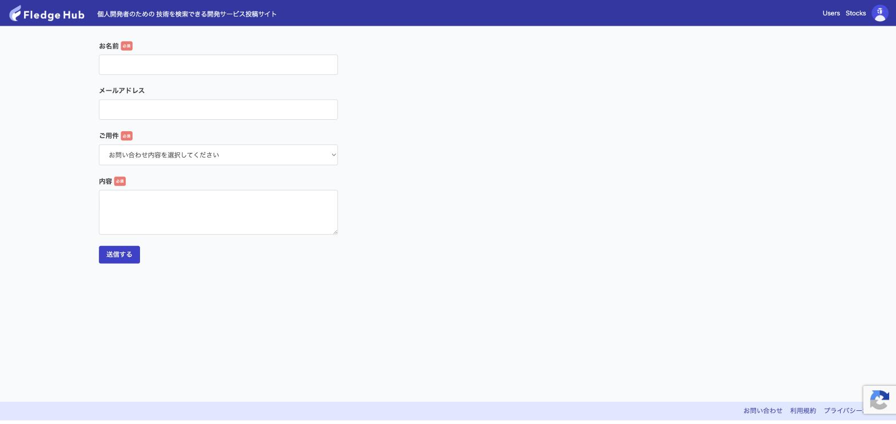 |
| 未ログイン時はヘッダーに「GitHub Login」ボタンが表示されます。GitHub OAuth でログインし、初回のみ screen_name・表示名・学習開始日・メールアドレスと利用規約への同意を登録します。 | ご意見・ご要望／不具合報告などを送信できるフォーム（reCAPTCHA v3 付き）。 |

## 関連リンク

- リポジトリ: https://github.com/runteq/fledge-hub
- Issue（機能要望・不具合報告）: https://github.com/runteq/fledge-hub/issues
- 環境構築手順: https://github.com/runteq/fledge-hub/wiki
- ER 図: [erd.png](../erd.png)
